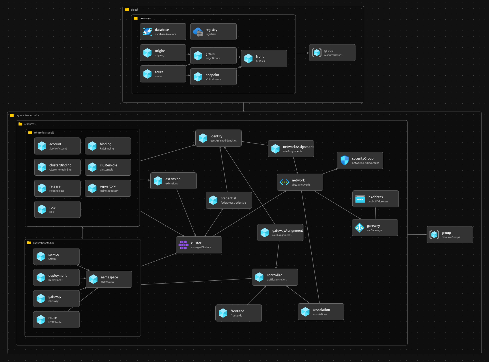

# 🌐 Geodes

This repository provides insights into implementing [Geodes](https://learn.microsoft.com/azure/architecture/patterns/geodes) pattern in Microsoft Azure through [Bicep](https://learn.microsoft.com/azure/azure-resource-manager/bicep/overview), following best practices for ensuring application resilience and high availability.

---


## Getting Started

Initiate authentication into the Azure CLI and then choose the preferred subscription.

```bash
az login
az account -s '{Subscription}'
```

Execute the provided Shell Script to generate a Deployment Stack and create the Azure resources outlined in this repository.

```bash
./eng/scripts/create.sh
```

Execute the given Shell Script to remove the Azure resources deployed through this repository; this will delete the Deployment Stack along with its associated resources.

```bash
./eng/scripts/delete.sh
```

## Repository Structure

In the `src/` directory, you'll find the following components:

- `main.bicep`: This Bicep file orchestrates the deployment of resource groups and resources.
- `functions/`: This directory contains a set of reusable functions, such as resource name generation.
- `modules/`:  In this directory, you'll find reusable scope and resource modules.
- `parameters/`: This directory holds parameter files for environment-specific configurations.
- `types/`: Contains type definitions for both templates and parameter files.

---

## Code Structure


