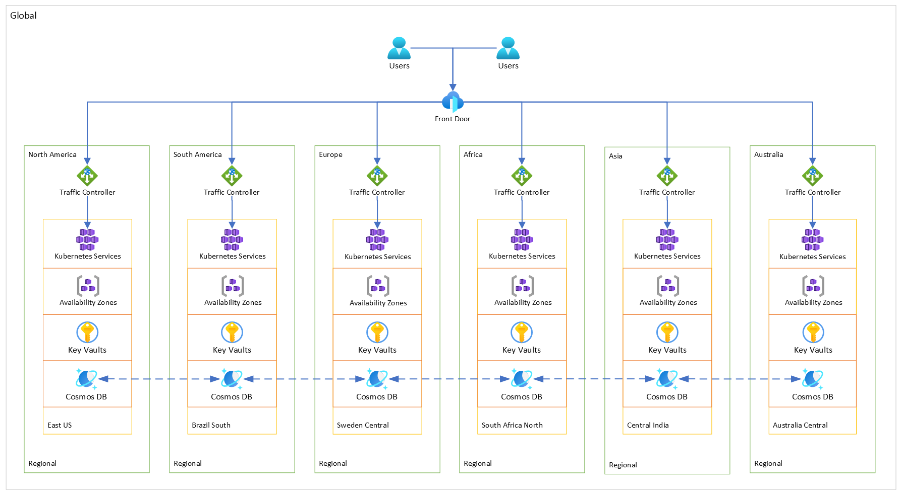

# 🌐 Geodes

This repository demonstrates how to implement the Geodes pattern in Microsoft Azure using Bicep. The Geodes pattern involves deploying a collection of backend services into a set of geographical nodes, with each node capable of servicing any request from any region. This active-active approach enhances latency and availability by distributing request processing around the globe.

Large-scale services often face challenges related to geo-availability and scale. Traditional designs tend to centralise data in a single location, which can result in increased network latency for distant users, difficulties managing sudden demand spikes, and the high costs associated with replicating infrastructure across regions. In contrast, the Geodes pattern leverages modern cloud capabilities to bring compute resources closer to distributed data. This design not only improves performance by reducing latency but also simplifies global scalability and resilience by decentralising both data and compute resources.

In this project, you will find examples, modules, and functions that follow these principles and Azure best practices. Whether your goal is to reduce latency, improve availability, or update your deployment strategy, this repository offers a practical starting point for implementing geo-distributed backend services.

[Microsoft Documentation](https://learn.microsoft.com/azure/architecture/patterns/geodes)



## Prerequisites

- **Azure Subscription:** You need an active Azure subscription.
- **Dev Container:** A dev container configuration is included in this repository to provide a consistent and isolated development environment. It is recommended that you use the dev container to ensure compatibility with the project's dependencies and tools.

## Getting Started

1. **Authenticate and set your subscription:**

    ```bash
    az login
    ```

2. **Set environment settings:**

    Update values within the `src/parameters/main.bicepparam` file.

3. **Deploy the Resources:**

    Create all resources using the following command:

    ```bash
    az stack sub create \
        --name 'Microsoft.Patterns' \
        --location 'uksouth' \
        --template-file './src/main.bicep' \
        --parameters './src/parameters/main.bicepparam' \
        --action-on-unmanage 'deleteAll' \
        --deny-settings-mode 'denyWriteAndDelete' \
        --yes
    ```

4. **Clean Up Resources:**

    To delete all resources, run:

    ```bash
    az stack sub delete \
        --name 'Microsoft.Patterns' \
        --action-on-unmanage 'deleteAll' \
        --yes
    ```

## Repository Structure

The `src/` directory is organised as follows:

- `main.bicep`: Orchestrates the deployment of resource groups and resources.
- `functions/`: Contains reusable functions, such as resource name generation.
- `modules/`: Houses reusable scope and resource modules.
- `parameters/`: Contains parameter files for environment-specific configurations.
- `types/`: Includes type definitions for both templates and parameter files.

## Contributing

Feel free to open issues or pull requests if you have any improvements or suggestions!
