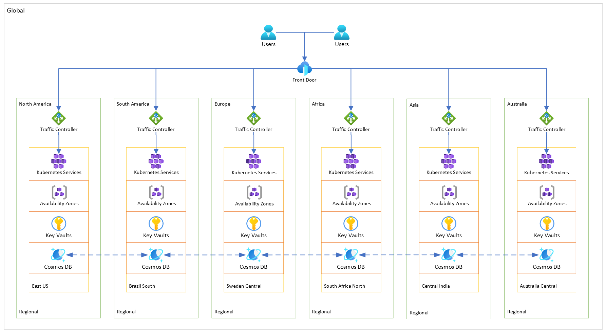

# 🌐 Geodes

This repository provides insights into implementing [Geodes](https://learn.microsoft.com/azure/architecture/patterns/geodes) pattern in Microsoft Azure through [Bicep](https://learn.microsoft.com/azure/azure-resource-manager/bicep/overview), following best practices for ensuring application resilience and high availability.

## Repository Structure

In the `src/` directory, you'll find the following components:

- `main.bicep`: This Bicep file orchestrates the deployment of resource groups and resources.
- `functions/`: This directory contains a set of reusable functions, such as resource name generation.
- `modules/`:  In this directory, you'll find reusable scope and resource modules.
- `parameters/`: This directory holds parameter files for environment-specific configurations.
- `types/`: Contains type definitions for both templates and parameter files.
